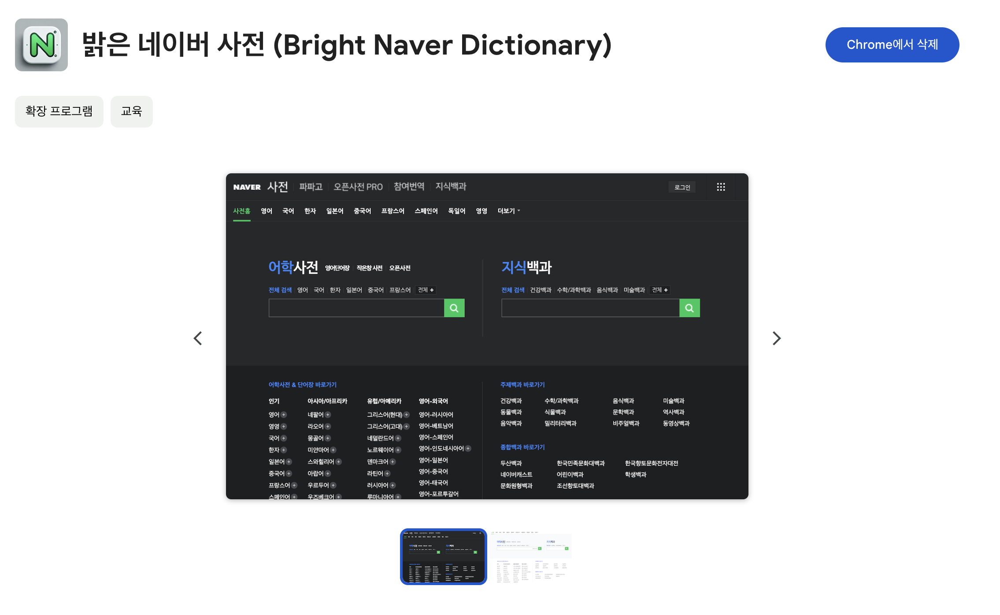

# bright-naver-dictionary-chrome-extension

## Description

네이버 사전은 브라우저 테마를 무조건 따라가게 돼있어서 다크 테마이면서 네이버 사전만 밝게 쓰는게 불가능했는데, 이 크롬 익스텐션을 사용하면 네이버 사전을 항상 밝게 사용할 수 있습니다.

## Installation

[Chrome Web Store](https://chromewebstore.google.com/detail/%EB%B0%9D%EC%9D%80-%EB%84%A4%EC%9D%B4%EB%B2%84-%EC%82%AC%EC%A0%84-bright-naver-di/pmnifccaihgpajcofmjimblebmbhaalf?hl=ko)



## Local Development

1. 이 저장소를 클론합니다.
   ```bash
   git clone https://github.com/gyu-young-park/bright-naver-dictionary-chrome-extension.git
   ```
2. Chrome 주소창에 `chrome://extensions`를 입력합니다.
3. 우측 상단의 **개발자 모드**를 활성화합니다.
4. **압축해제된 확장 프로그램을 로드합니다** 버튼을 클릭하고, 클론한 폴더를 선택합니다.
5. [dict.naver.com](https://dict.naver.com)에 접속하여 라이트 테마가 적용되는지 확인합니다.

코드를 수정한 뒤에는 `chrome://extensions`에서 확장 프로그램의 새로고침 버튼을 클릭하고, 네이버 사전 탭을 새로고침하면 변경 사항이 반영됩니다.
